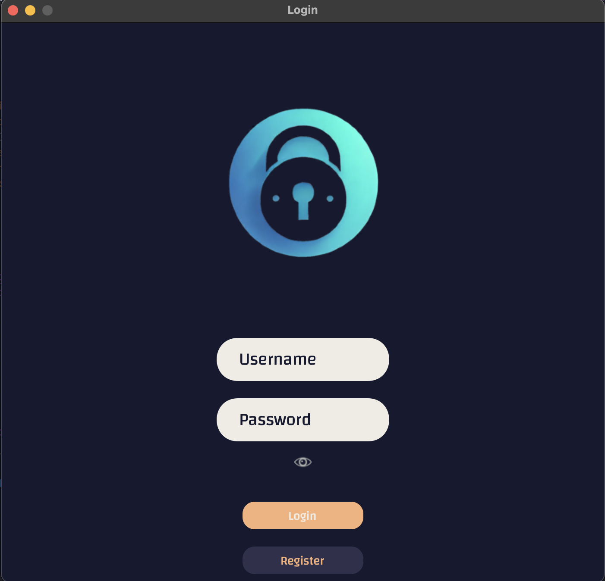
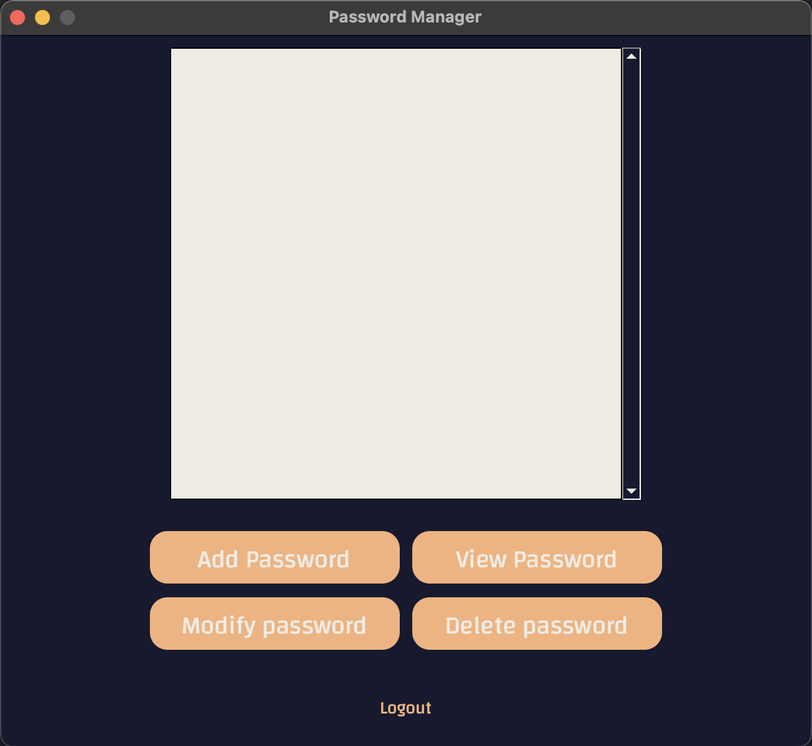
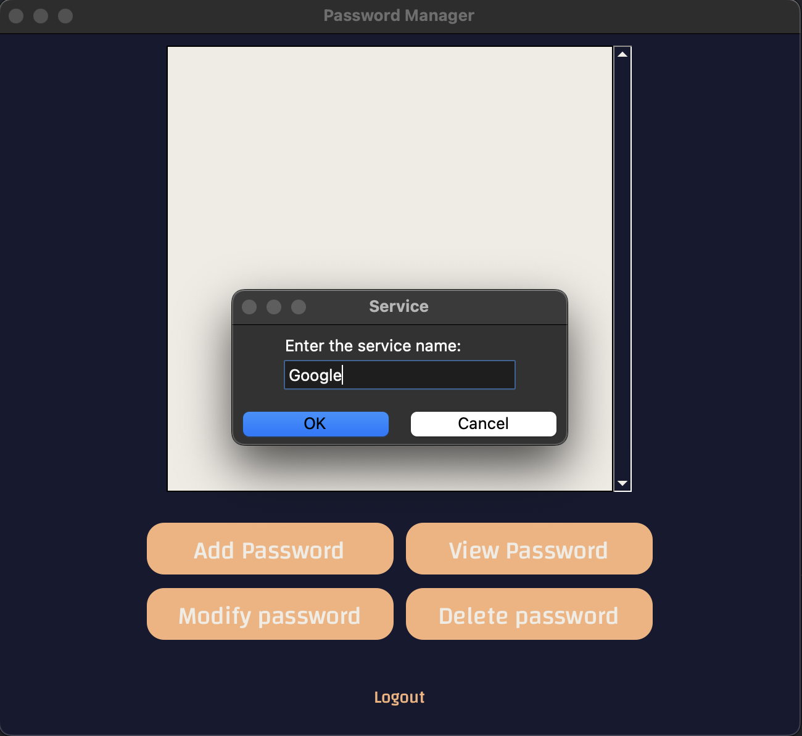
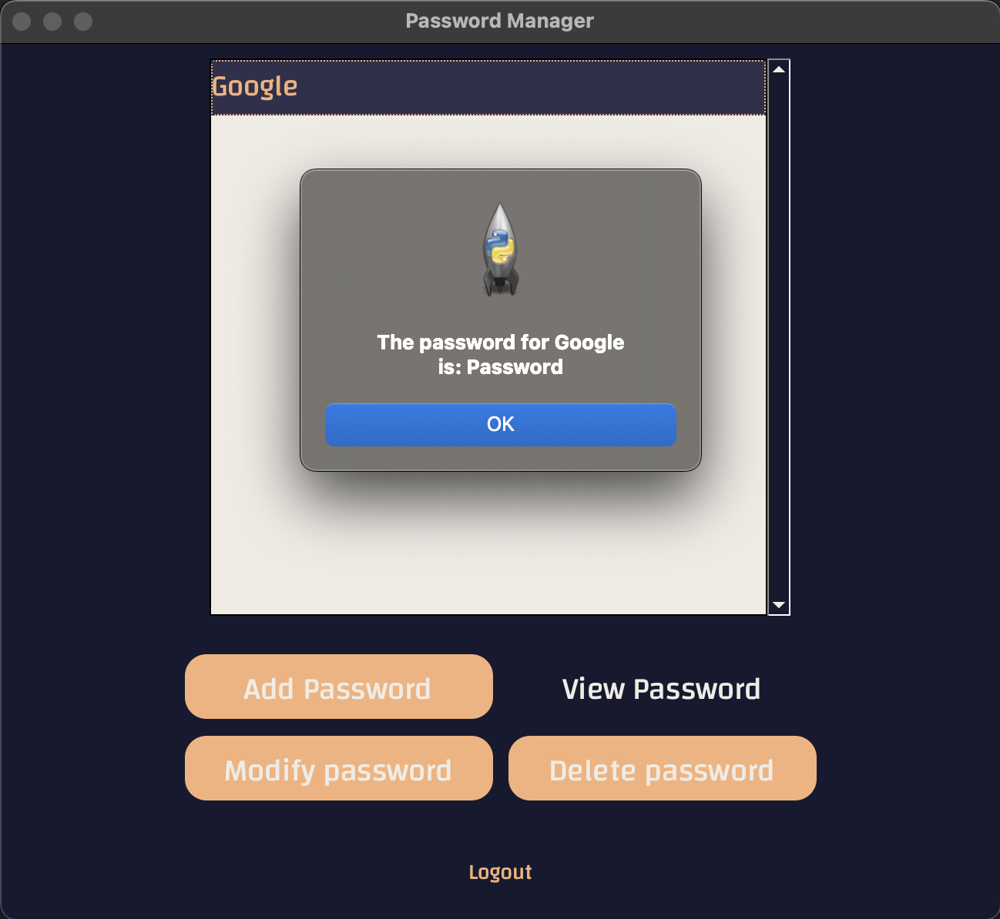

# Password Manager GUI Application

A modern, secure, and user-friendly password manager built with Python and [customtkinter](https://github.com/TomSchimansky/CustomTkinter). This application allows you to securely store, view, modify, and delete your passwords for various services, all protected by a master login.

---

## Features

- **User Registration & Login:** Secure authentication with hashed passwords.
- **Password Encryption:** All stored passwords are encrypted using AES-GCM.
- **Modern GUI:** Clean, responsive interface using customtkinter.
- **Password Management:** Add, view, modify, and delete passwords for different services.
- **Persistent Storage:** User and password data are stored in local JSON files.
- **Cross-Platform:** Runs on Windows, macOS, and Linux.

---

## Screenshots

### Login Screen


### Dashboard


### Add Password


### View Password


---

## Getting Started

### Prerequisites

- Python 3.8+
- [pip](https://pip.pypa.io/en/stable/)

### Install Dependencies

```sh
pip install -r requirements.txt
```

If you don't have a `requirements.txt`, you can install the main dependencies manually:

```sh
pip install customtkinter cryptography bcrypt pillow
```

### Running the Application

You can run the application using the provided Makefile:

```sh
make run
```

Or directly with Python:

```sh
python main.py
```

---

## Project Structure

```
.
├── main.py
├── gui/
│   ├── login_screen.py
│   └── password_manager.py
├── utils/
│   ├── file_utils.py
│   └── crypto_utils.py
├── .data/
│   ├── .user.txt
│   └── .password.txt
├── pictures/
│   ├── logo.png
│   └── eye.png
└── README.md
```

---

## Security

- User passwords are hashed using bcrypt.
- Service passwords are encrypted with AES-GCM and a key derived from a master password using PBKDF2.
- All sensitive data is stored in `.data/` as JSON files.

---

## Customization

- **Themes & Colors:** Easily change UI colors and fonts in the GUI files.
- **Logo & Images:** Replace images in the `pictures/` directory to personalize the app.

---

## License

This project is licensed under the MIT License. See the [LICENSE](LICENSE) file for details.

---

## Credits

- [CustomTkinter](https://github.com/TomSchimansky/CustomTkinter) for the modern tkinter widgets.
- [Cryptography](https://cryptography.io/) and [bcrypt](https://pypi.org/project/bcrypt/) for secure password handling.

---

## Disclaimer

This project is for educational purposes. For production use, consider additional security measures and code reviews.
